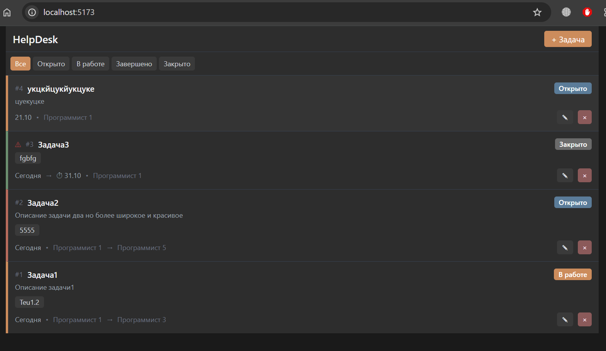

# HelpDesk - Система управления задачами



## Описание

Полнофункциональная система управления задачами для команды программистов с современным интерфейсом в темной теме.

## Функционал

✓ **Управление задачами** - создание, редактирование, удаление
✓ **Команда** - 5 программистов, назначение исполнителей
✓ **Статусы** - открыто, в работе, завершено, закрыто
✓ **Приоритеты** - низкий, средний, высокий (цветные индикаторы)
✓ **Дедлайны** - с автоматической подсветкой просроченных
✓ **Срочность** - мигающий индикатор для важных задач
✓ **Теги** - категоризация задач
✓ **Счетчики** - комментарии, файлы, подзадачи
✓ **Темная тема** - в стиле Claude AI
✓ **Мобильная версия** - адаптивный компактный дизайн

## Технологии

- **Backend**: Node.js + Express + JSON Database
- **Frontend**: React + Vite + Tailwind CSS

## Установка и запуск

### Windows

1. **Установка зависимостей:**
   ```bash
   install.bat
   ```

2. **Запуск проекта:**
   ```bash
   start.bat
   ```

3. Откройте браузер: `http://localhost:5173`

### Linux/Mac

1. **Установка зависимостей:**
   ```bash
   cd backend && npm install && cd ..
   cd frontend && npm install && cd ..
   ```

2. **Запуск проекта:**
   ```bash
   # Терминал 1
   cd backend && npm run dev

   # Терминал 2
   cd frontend && npm run dev
   ```

3. Откройте браузер: `http://localhost:5173`

## Структура проекта

```
PRJ1/
├── backend/          # Node.js + Express сервер
│   ├── server.js     # API endpoints
│   ├── database.js   # JSON база данных
│   └── package.json
├── frontend/         # React приложение
│   ├── src/
│   │   ├── App.jsx   # Главный компонент
│   │   └── index.css # Стили
│   └── package.json
├── install.bat       # Скрипт установки (Windows)
├── start.bat         # Скрипт запуска (Windows)
└── README.md
```

## API Endpoints

- `GET /api/users` - Список пользователей
- `GET /api/tasks` - Список задач
- `POST /api/tasks` - Создать задачу
- `PUT /api/tasks/:id` - Обновить задачу
- `DELETE /api/tasks/:id` - Удалить задачу

## Деплой на reg.ru

1. **Соберите frontend:**
   ```bash
   cd frontend && npm run build
   ```

2. **Загрузите на сервер:**
   - `backend/` - весь бэкенд
   - `frontend/dist/` - собранный фронтенд

3. **Настройте веб-сервер:**
   - Статика из `frontend/dist/` → `/`
   - API `/api/*` → проксирование на backend (порт 3000)

## Автор

🤖 Generated with [Claude Code](https://claude.com/claude-code)
